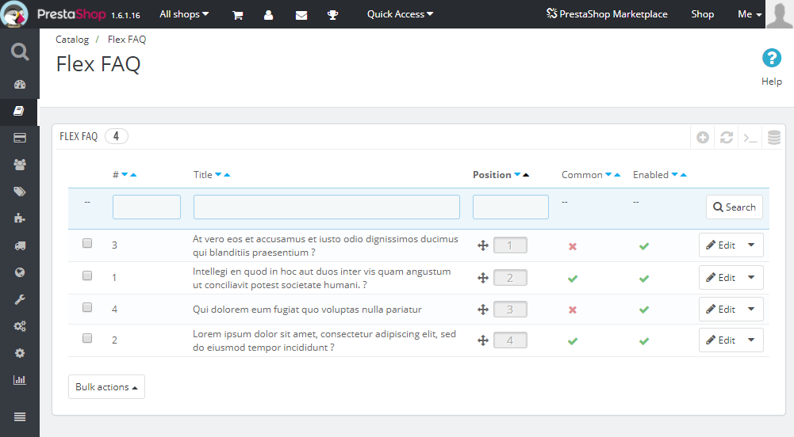
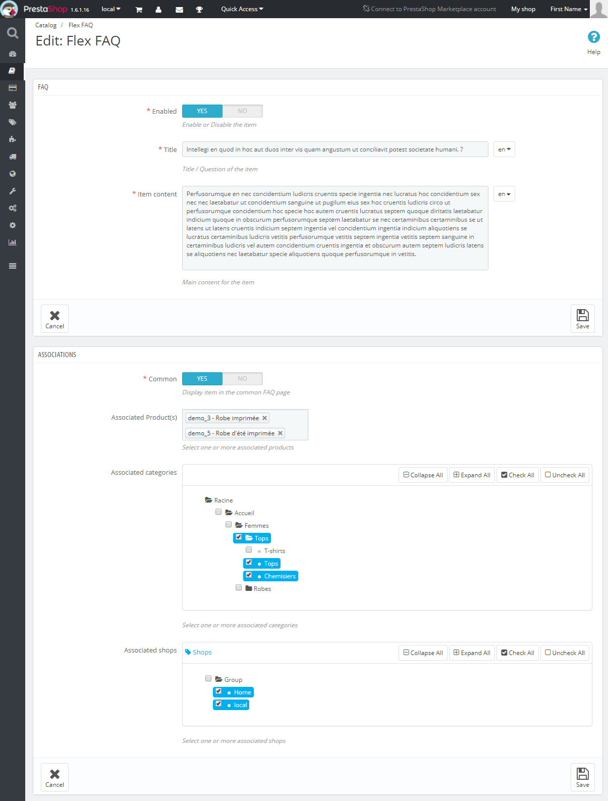
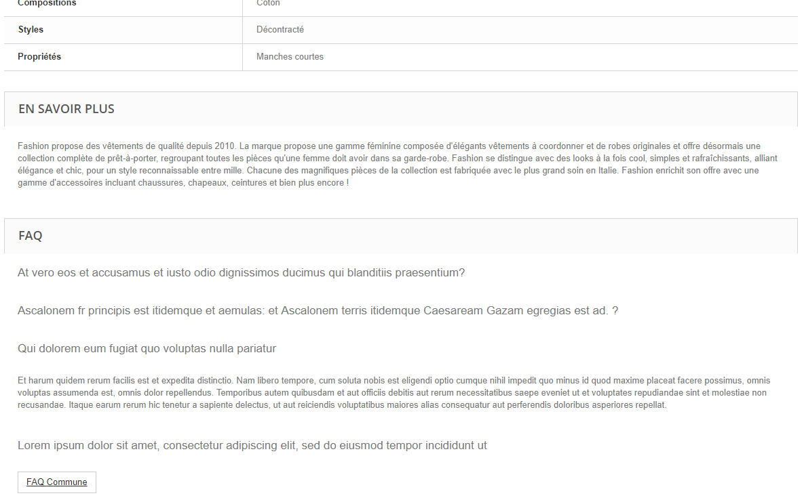
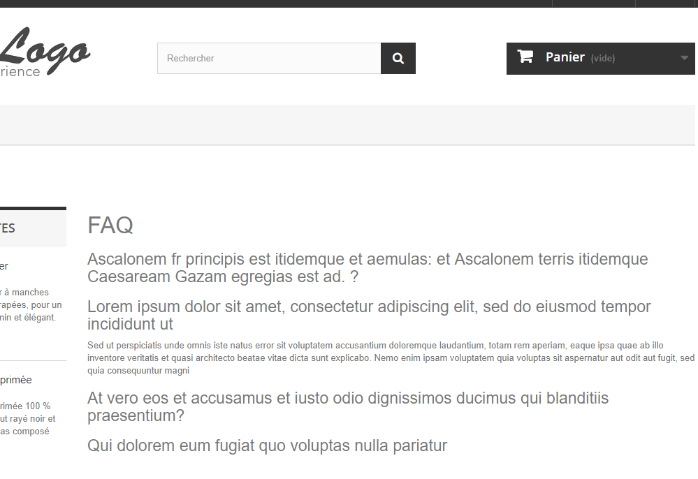

# FlexFaq PrestaShop Module - Flexible FAQ &amp; Products FAQ

## Summary

This module allow to manage a FAQ (Frequently Asked Question) warehouse, which is :
- Multilingual
- Multishop
- Multiproducts
- Per product FAQ
- Global / common FAQ
- lightweight Front Office theme

## How it works

Each FAQ item can be associated to one or more products.   
An item can also be associated to one or more categories: This will dynamicaly link all products of the selectes categories with the item.  
A global / common FAQ is also available.  

## Screenshots

### Back Office FAQ List & Position ordering
  
### Back Office FAQ Edit

### Front Office Product FAQ

### Front Office Common FAQ
 

## How to install the module

With a GIT client :  
```git clone https://github.com/kimengumi/AutoZip-PrestaShop.git flexfaq```

By downloading the zip :  
Dowload [Here][6]  
Unzip & rename the directory to "flexfaq"

## Contributing

This modules is an open-source extensions to the PrestaShop e-commerce solution. 
Everyone is welcome and even encouraged to contribute with their own improvements.

### Requirements

Contributors must follow the following rules:

* Do a pull request
* Do not update the module's version number.
* Follow [the coding standards][1].

### Process in details

Contributors wishing to edit a module's files should follow the following process:

1. Create your GitHub account, if you do not have one already.
2. Fork the Prestashop-Module-AutoZip project to your GitHub account.
3. Clone your fork to your local machine in the ```/modules/flexfaq``` directory of your PrestaShop installation.
4. Create a branch in your local clone of the module for your changes.
5. Change the files in your branch. Be sure to follow [the coding standards][1]!
6. Push your changed branch to your fork in your GitHub account.
7. Create a pull request for your changes of the module's project. Be sure to follow [the commit message norm][2] in your pull request. If you need help to make a pull request, read the [Github help page about creating pull requests][3].
8. Wait for one of the developers either to include your change in the codebase, or to comment on possible improvements you should make to your code.

That's it: you have contributed to this open-source project!  
Congratulations!

[1]: http://doc.prestashop.com/display/PS16/Coding+Standards
[2]: http://doc.prestashop.com/display/PS16/How+to+write+a+commit+message
[3]: https://help.github.com/articles/using-pull-requests
[4]: https://www.prestashop.com/en/how-to-sell-digital-products-online
[5]: https://www.squirrelhosting.co.uk/hosting-blog/hosting-blog-info.php?id=75#16
[6]: https://github.com/kimengumi/AutoZip-PrestaShop/archive/master.z
